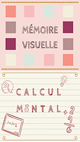

# Educative Game

A mobile educative game for kids to improve their skills in memory and simple mathematical operations 

The game application is available in english and french version.

# About the game

### The start menu

### Practicing the memory

### Practice the mathematical operations skills
